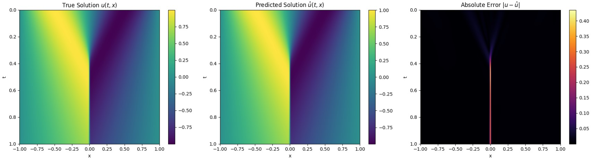
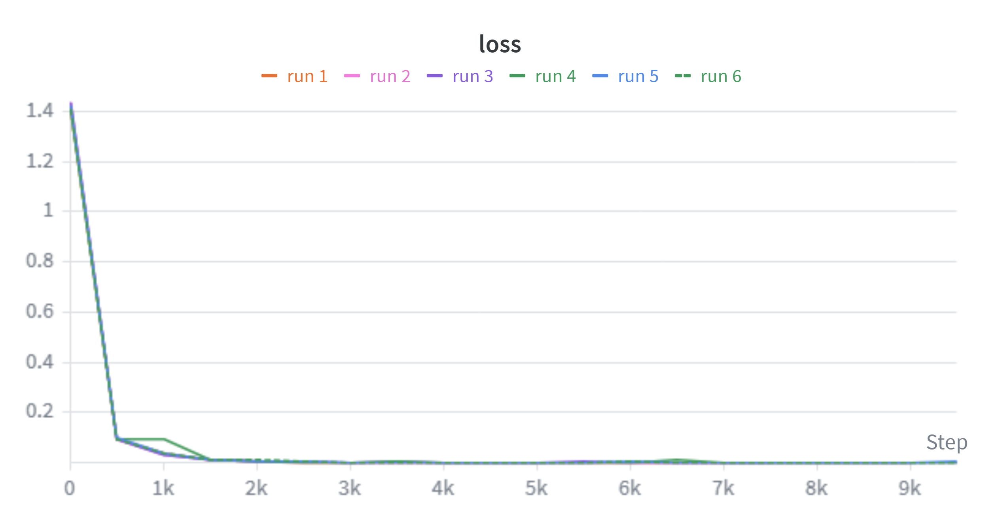
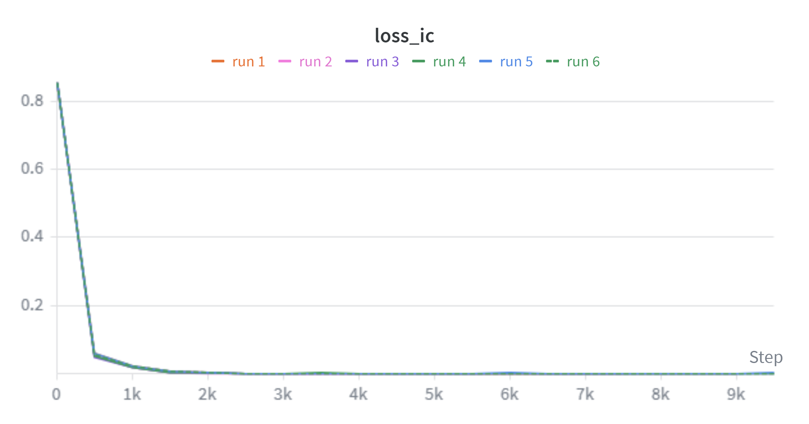
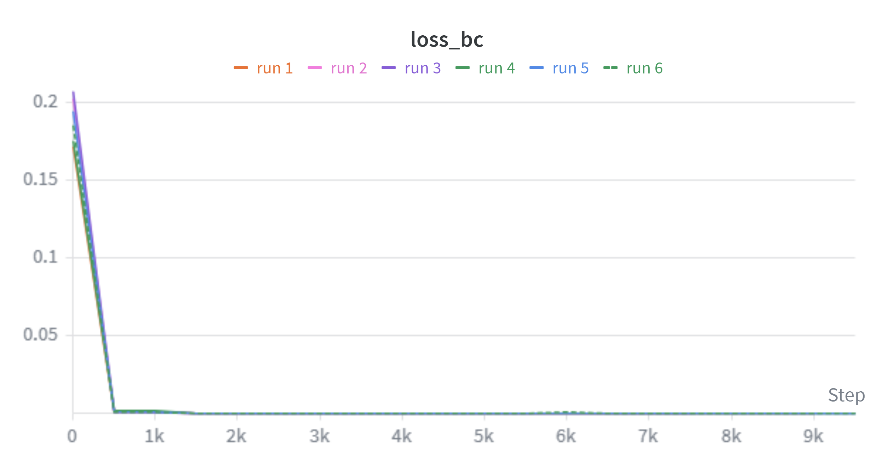
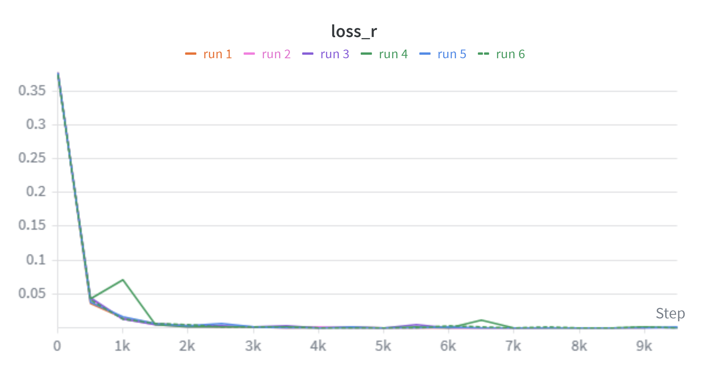

# PINNs-Burgers-JAX

A physics-informed neural network (PINN) implemented in JAX/Flax to solve the 
1D viscous Burgers' equation, with collocation-based PDE residual loss and 
Weights & Biases experiment tracking.

## Overview

PINNs embed physical laws directly into the training loss of a neural network,
eliminating the need for labeled solution data. This project solves the 1D 
viscous Burgers' equation:

$$u_t + u u_x = \nu u_{xx}, \quad \nu = 0.01/\pi$$

on the domain $x \in [-1, 1]$, $t \in [0, 1]$ with initial condition 
$u(x, 0) = -\sin(\pi x)$ and boundary conditions $u(\pm 1, t) = 0$.

## Results

The PINN accurately recovers the reference solution, with error concentrated 
near the shock region around $x = 0$ at later times — a known challenge for 
this equation due to the steep gradient.



### Training Curves (Weights & Biases, 6 runs)

| Total Loss | IC Loss |
|------------|---------|
|  |  |

| BC Loss | Residual Loss |
|---------|---------------|
|  |  |

All losses converge within ~2,000 steps and remain stable through 10,000 steps.

## Architecture

- 4-layer MLP with tanh activations, hidden dim 64
- Loss = IC loss + BC loss + PDE residual loss
- Optimizer: Adam (lr = 1e-3)
- 10,000 collocation points sampled uniformly over the domain
- Trained for 10,000 steps

## Installation
```bash
pip install -r requirements.txt
```

## Usage
```bash
python main.py
```

> **Note:** requires `burgers.mat` in the root directory. The dataset is not 
> included in this repo due to size. It can be obtained from the 
> [original PINNs repository](https://github.com/maziarraissi/PINNs).

## References

Raissi, M., Perdikaris, P., & Karniadakis, G. E. (2019). Physics-informed 
neural networks: A deep learning framework for solving forward and inverse 
problems involving nonlinear partial differential equations. 
*Journal of Computational Physics*, 378, 686–707.